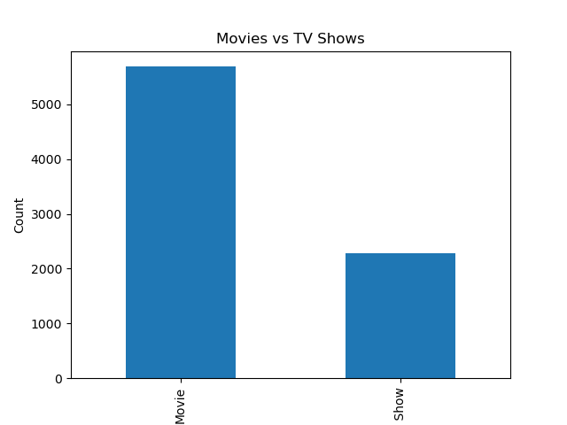
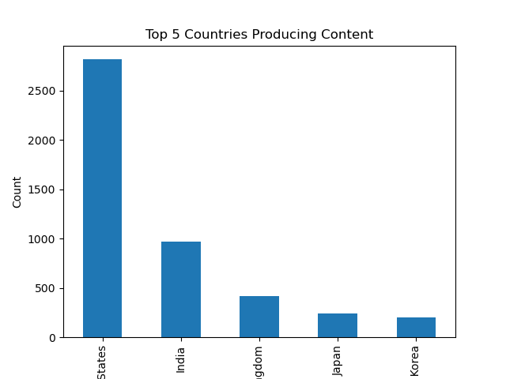
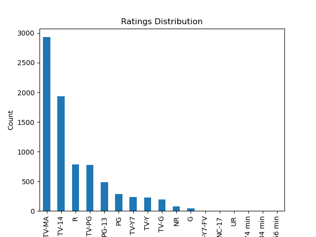
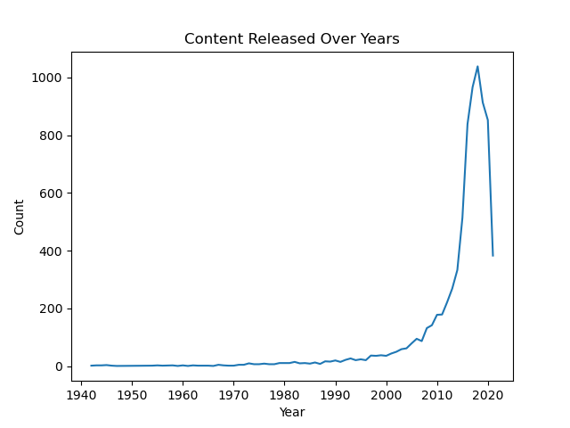
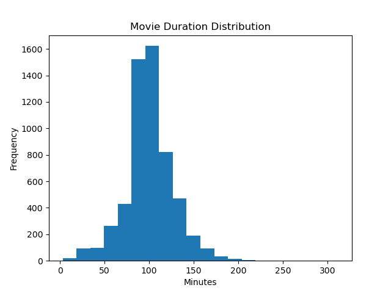

# 🎬 Netflix Data Analysis

## 🚀 Overview
This project analyzes Netflix dataset to uncover trends in content type, country distribution, and ratings.

## 🛠️ Tools Used
- Python
- Pandas
- Matplotlib

## 📊 Key Insights
- Movies are more than TV Shows
- USA/India dominate content production
- Most content is rated TV-MA or PG-13

## 📷 Visualizations

## 📊 Advanced Insights
- Content production increased rapidly after 2015
- Most movies are around 90–120 minutes
- Netflix has diversified content globally

## 📷 More Visuals

